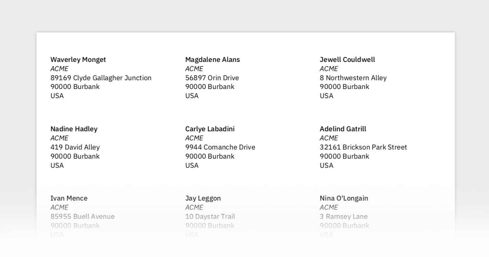

# Labels

Generates a simple PDF document to print sticker labels. 

It is, to our surprise, a very trickly/annoying thing to do. There is software out there for doing this, but you have to pay yearly plans just to generate a few pages. Sometimes they do not have the type of stickers you need, or the correct number of rows or columns. Furthermore, after all of that, some printers do not handle margins correctly or lie about it.

This simple script takes a CSV file and uses [PrawnPDF](http://prawnpdf.org). This allows you to set all those parameters manually to get them right. With a little bit of trial and error the correct PDF document is ready for printing.

### How to use

1. Install gems with `bundle install`

2. Drop CSV data inside `data.csv`. Format: `Name, Address Line 1, Address Line 2`

3. Tweak params inside the `bin/generate` file to match your paper/printer

4. Run `bin/build` to generate the PDF

5. If you run into layout problems there is a `debug` flag